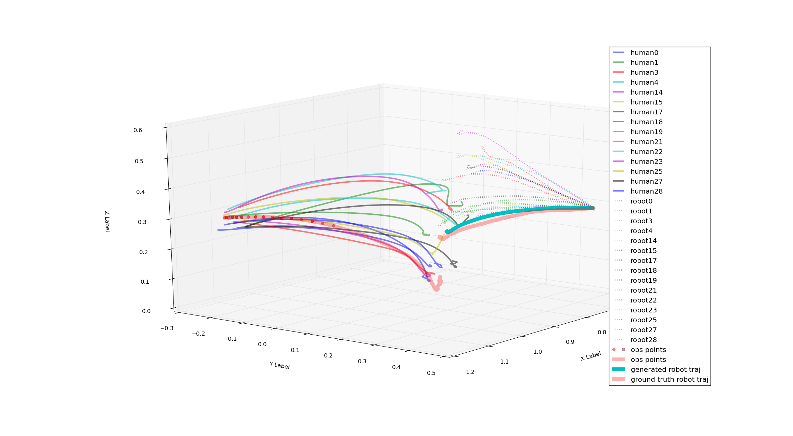

# Interaction ProMPs  
Interaction ProMPs generate a robot collaborative motion based on the prediction from a set of partial human motion observations. 

The approach also works in multi-task scenarios. This package use EMG signals to enhance the task recognition.   
Not make sure if the EMG signals are correlated with robot motion and we will confirm it latter. 

# Dependences
Serveral dependeces for this package. 
## ML packages: 

 - Python >=2.6
 - NumPy
 - sklearn
 - SciPy >= 0.19.1
 - pandas

## robotics packages: 

 - openni_launch
 - aruco_hand_eye
 - openni_tracker

## custom packages: 
 - myo_driver
 - states_manager

# upgrade scipy
Need to upgrade the scipy especially to use the probability python module.   
1. Install the gfortran. Maybe need to install gfortran-5 as dependency.  
2. Upgrade the scipy with `sudo easy_install --upgrade scipy`  
(not sure need to upgrade the numpy with `sudo easy_install --upgrade numpy`)  
The reference tutorial is [ref](https://askubuntu.com/questions/682825/how-to-update-to-the-latest-numpy-and-scipy-on-ubuntu-14-04lts).  

# The package architecture  
├── cfg  
│   └── params.cfg  
├── datasets  
│   └── dataset_name  
│       ├── info  
│       ├── pkl  
│       └── raw  
├── scripts  
│   ├── bag_to_csv.sh  
│   ├── batch_bag2csv.py  
│   ├── data_visualization.py  
│   ├── ipromps_lib.py  
│   ├── load_data.py  
│   ├── noise_cov_cal.py  
│   ├── test_online.py  
│   ├── train_models.py  
│   └── train_offline.py  
├── README.md  
├── CMakeLists.txt  
└── package.xml  

## cfg
`models.cfg`: the configuration including all params.

## datasets
The datasets path involves multiple demo data in `raw` path, the middle data in `pkl` path and notes in `info` path. 

## scripts
The scripts to load data, train models and test it online.  
`bag_to_csv.sh`: a script to convert single rosbag to csv, called in `batch_bag2csv.py`  
`batch_bag2csv.py`: a batch python script to convert rosbag to csv, run it in terminal for some ros shell script  
`ipromps_lib.py`: the lib for IProMP including unit ProMP, ProMPs and Interaction ProMPs  
`load_data.py` : load the data from csv file, filter the data and resample the data as same duration  
`train_models.py`: train the models from the loaded data  
`train_offline.py`: train the Interaction ProMPs (load data and train model), call for `load_data.py` and `train_models.py`  
`visualization.py`: visualization for data  
`noise_cov_cal.py`: theorically measure the observation noise covariance matrix  
`test_online.py`: test the trained models  

# The command steps to run experiment
All commands run in **baxter.sh** space.  
1. `roslaunch openni_launch openni.launch`: open the xtion  
2. `roslaunch aruco_hand_eye baxter_xtion_cal_pub.launch`: load the baxter-xtion calibration result  
3. `rosrun rviz rviz`: open the ros visualization windows  
4. `rosrun openni_tracker openni_tracker`: open the human skeleton tracking node  
5. `roslaunch myo_driver myo_raw_pub.launch`: start the Myo armband node  
6. `rosrun states_manager states_pub.py`: open the state manager node  

# The notes for collecting datasets
Some notes need to read everytime when collecting the demo data. 

## Datasets collection
Everytime when collecting the datasets, please read these notes.   

 - **Check** the csv file derived from rosbag  
 - **In the same time**, start to record dataset and demonstrate a task  
 - Demonstrate a task with **spatio-temporal variance** , limit the demonstration motion space and use simple motion  
 - **Overfitting advoidance**  
    - cleaning/pruning  
        - decrease the unexpected noise: **no vision occlusion** about human motion tracking.  
        - keep consistent: not easy actually. One option is to demonstrate the simple trajectory like moving the hand toward the destination along a straight line as best as possible. The trajectories should not be too complex.  
        - validation: one guidance to choose the suitable training set.  
    - Increase demonstration number: 10-15 demonstration is the better.
    
## Take notes in training process
Take some significant notes to be used in testing.  

 - Armband wear position on hand  
 - Object grasp position  
 - Collaborative task process video  

